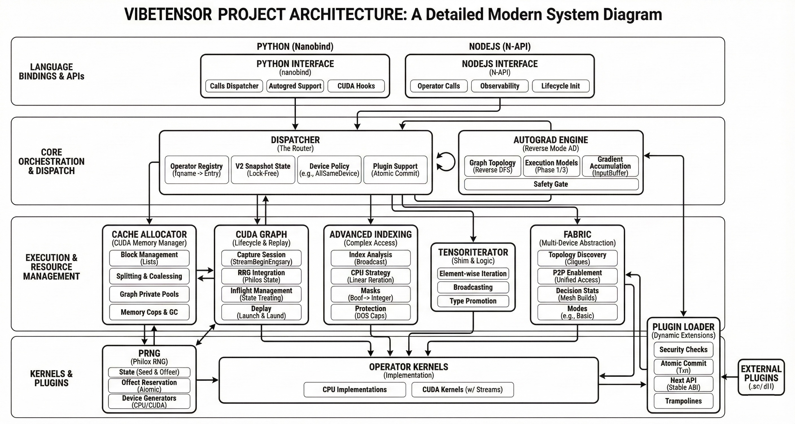

# VibeTensor: System Software for Deep Learning, Fully Generated by AI Agents

[[`research paper`](https://arxiv.org/abs/2601.16238)]

*From Node.js/Python to PTX assembly:* a research deep-learning system fully generated by AI agents.

## Research positioning
VIBETENSOR is an open-source systems research artifact generated by LLM-powered coding agents under high-level human guidance. “Fully generated” refers to code provenance and validation: implementation changes are proposed and applied as agent-generated diffs, with correctness enforced via builds, tests, and differential checks rather than per-change manual review. We view this open-source release as a milestone for AI-assisted software engineering: it demonstrates that coding agents can generate and validate a coherent deep learning runtime spanning language bindings down to CUDA memory management, with correctness constrained primarily by builds and tests. **As a sanity check on system completeness, we successfully ran end-to-end training on three small workloads spanning computer vision and language modeling using the generated stack, including multi-GPU execution paths.**

> [!WARNING]
> This repository is released for agentic system research purposes only.  
> Everything in this repo is generated by AI agents. Do **not** use this project for production


VibeTensor is a PyTorch-inspired eager runtime with a fresh **C++20** core (CPU + CUDA), a torch-style **Python** overlay, and an experimental **Node.js / TypeScript** API.

Unlike “thin wrappers”, VibeTensor implements its own tensors/storage, dispatcher, autograd engine, CUDA runtime + caching allocator, and plugin ABI.

- **C++ core**: `TensorImpl`/`Storage`, schema-lite dispatcher, TensorIterator, reverse-mode autograd, indexing, RNG.
- **CUDA subsystem**: streams/events, stream-ordered caching allocator (stats/snapshots, fraction cap, GC ladder), CUDA Graph capture/replay.
- **Interop**: DLPack import/export (CPU + CUDA) for zero-copy exchange with other frameworks. A fresh C++20 Safetensors loader/saver.
- **Extensibility**: dynamic operator plugins (stable C ABI), Python overrides (`vibetensor.library`), Triton bridge and CuTeDSL runtime.
- **Experimental multi-GPU**: Fabric tensors (UVA/NVLink topology + observability) and a best-effort CUTLASS Blackwell ring allreduce plugin (requires CUDA 13+ and an sm103a-capable toolchain).

Scale (at time of writing): ~218 C++/CUDA source files (~60k non-blank lines) plus ~50k non-blank lines of tests (C++ + Python + JS).


## Why this repository exists

VibeTensor started as a **system-software experiment**: can AI agents generate a coherent deep learning stack spanning Python/JS bindings → a C++ runtime → CUDA allocator/streams → GPU kernels?

The project uses a “least intervention” methodology: high-level architectural prompts, with success measured by whether the system builds, passes tests, and produces correct results.

### Performance caveat (“Frankenstein Effect”)

VibeTensor is designed correctness-first and is **not performance-competitive with PyTorch today**. One failure mode we observed is that components can be individually robust but become globally suboptimal when composed (e.g., global serialization in the hot path).

Treat VibeTensor as a **research prototype**.


## Architecture (macro view)



At a high level:

- **Frontends**: Python (nanobind) and Node.js (N-API) both dispatch into the same C++ operator registry.
- **Core runtime**: tensor/storage + dispatcher + autograd + indexing + RNG.
- **CUDA runtime**: stream/event wrappers, allocator, graphs, kernel launch helpers.
- **Compute layer**: built-in CUDA kernels + optional Triton/CuTeDSL kernels + plugin-loaded kernels.
- **Multi-GPU experiments**: Fabric tensors and observability (stats + event ring).

### Module Architecture Diagrams

For more detailed architecture of individual modules, see the diagrams in `docs/images/`:

| Module | Description |
|--------|-------------|
| [Cache Allocator](docs/images/cache-allocator.jpg) | Stream-ordered CUDA memory allocation and caching |
| [Dispatcher](docs/images/dispatcher.jpg) | Central operator routing and registry |
| [Autograd](docs/images/autograd.jpg) | Reverse-mode automatic differentiation engine |
| [Fabric](docs/images/fabric.jpg) | Multi-device topology and unified memory access |
| [CUDA Graph](docs/images/cuda-graph.jpg) | Graph capture and replay management |
| [TensorIterator](docs/images/tensor-iterator.jpg) | Element-wise operation and broadcasting engine |


## Project status

VibeTensor is an active research project; APIs and behavior may change without notice.

Current code covers:

- CPU & CUDA tensors, views, and DLPack import/export.
- Dispatcher with CPU/CUDA kernels for a scoped `vt::` op set (elementwise + reductions via TensorIterator).
- Stream-ordered CUDA caching allocator with observability hooks (stats/snapshots, fraction cap, GC ladder).
- Reverse-mode autograd with in-place/view guards and boxed fallbacks (plus an experimental multi-device mode).
- Indexing: basic indexing plus advanced indexing (configurable via env flags; some CUDA paths).
- Fabric: experimental single-process multi-GPU elementwise (`vibetensor.fabric`) with stats/events snapshots.
- Python overlay (`vibetensor.torch`) with factories, `ops` namespace, CUDA helpers, and Triton integration.
- Experimental Node N-API addon and JS/TS overlay (CPU tensors + CUDA runtime helpers; best-effort in CI).


## Platforms & requirements

- Linux x86_64 (reference platform)
- Python >= 3.10
- CMake >= 3.26 and a C++20 compiler (GCC/Clang)
- NVIDIA GPU + CUDA toolkit (CI uses CUDA 13.0.2; CUDA 12+ expected). **CUDA is required**; CPU-only builds are disabled.
- Optional (for JS/TS overlay / addon build):
  - Node.js 22 + npm
  - Node-API headers (`node_api.h`) discoverable by CMake (set `NODE_INCLUDE_DIR` / `NODEJS_INCLUDE_DIR` if needed)


## Install & build

### Editable dev install (recommended)

From the repository root:

```bash
python -m pip install -U pip build pytest numpy
export CUDACXX=$(which nvcc)
CMAKE_BUILD_TYPE=Debug \
  python -m pip install -v -e .[test]
# Build tree: build-py/ (configured in pyproject.toml)
```

This drives CMake via scikit-build-core (build dir: `build-py/`), building:

- the `vbt_core` C++ static library and C++ tests into `build-py/`,
- the compiled extension `build-py/python/vibetensor/_C*.so` (installed into your Python env) and Python sources under `python/vibetensor/`,
- the Node addon `js/vibetensor/vbt_napi.node` when Node + Node-API headers are available (best-effort).

Defaults are configured in `pyproject.toml`; override via `-Ccmake.define.*` (for example, `-Ccmake.define.VBT_BUILD_NODE=OFF`).
If CMake can't find `node_api.h`, set `NODE_INCLUDE_DIR=/path/to/include/node` (or pass `-Ccmake.define.NODEJS_INCLUDE_DIR=...`).

### Manual CMake build

```bash
cmake -S . -B build -DCMAKE_BUILD_TYPE=Debug \
  -DVBT_USE_CUDA=ON -DVBT_BUILD_TESTS=ON -DVBT_WITH_AUTOGRAD=ON
cmake --build build -j
```

### Wheels (Release)

```bash
CMAKE_BUILD_TYPE=Release python -m build --wheel
```


## Quickstart

### Python: torch-style overlay

The main user-facing API is `vibetensor.torch`, a lightweight torch-like overlay built on top of the C++ core.

```python
import vibetensor.torch as vt

# Create CPU tensors
a = vt.tensor([[1.0, 2.0], [3.0, 4.0]], dtype="float32")
b = vt.ones_like(a)

# Call dispatcher-backed ops via the ops namespace
c = vt.ops.vt.add(a, b)
d = vt.ops.vt.relu(c)
print(d.sizes, d.dtype, d)

# DLPack interop with other frameworks (e.g., PyTorch)
from torch.utils import dlpack as torch_dlpack

torch_tensor = torch_dlpack.from_dlpack(vt.to_dlpack(d))
```

CUDA helpers (streams, events, memory stats) live under `vibetensor.torch.cuda`:

```python
from vibetensor.torch import cuda

stream = cuda.Stream()
with stream:
    pass
stream.synchronize()
```

For lower-level access (bindings/tests), import the native extension directly:

```python
from vibetensor import _C as C

print(C._has_cuda, C._cuda_device_count())

a = C._cpu_zeros([2, 2], "float32")
b = C._cpu_full([2, 2], "float32", 3.0)

c = C.vt.add(a, b)    # vt::add(Tensor, Tensor) -> Tensor
r = C.vt.relu(c)      # vt::relu(Tensor) -> Tensor
print(r.sizes, r.dtype, r.device)
```

### Node.js / TypeScript (experimental)

The Node addon and JS/TS overlay live under `js/vibetensor/`.

After an editable install has produced `js/vibetensor/vbt_napi.node`, you can run the JS tests locally:

```bash
# From the repository root, after the editable install
export VBT_NODE_ADDON_PATH="$(pwd)/js/vibetensor/vbt_napi.node"
cd js/vibetensor
npm ci
npm test    # runs TypeScript build then `node --test`
```

A minimal usage example (from `js/vibetensor` after `npm run build`):

```ts
import { zeros, ops, cuda } from './dist/index.js';  // or 'vibetensor' when packaged

async function main() {
  const a = await zeros([2, 2]);
  const b = await zeros([2, 2]);
  const c = await ops.vt.add(a, b);

  console.log('sizes=', c.sizes, 'dtype=', c.dtype, 'device=', c.device);

  if (cuda.isAvailable()) {
    const stream = cuda.Stream.create(0);
    await stream.synchronize();
  }
}

main().catch((err) => {
  console.error(err);
  process.exitCode = 1;
});
```

The JS overlay is fully async: heavy work (CUDA ops, H2D/D2H copies, waits) is scheduled via `napi_async_work` and does not block the Node event loop.

Note: JS `Tensor` objects are currently CPU-only; CUDA is exposed via `cuda.*` (streams/events), explicit `h2d`/`d2h`, and DLPack import/export.


## Dynamic operators, plugins, and Triton

VibeTensor exposes several extension points:

- **Python overrides** (`vibetensor.library`): a `torch.library`-style interface for defining Python implementations that run on top of the C++ dispatcher.
- **C / CUDA plugins**: `_C._load_library("/path/to/libvbt_*.so")` loads external shared libraries that register new vt ops.
- **Triton bridge** (`vibetensor.triton` and helpers under `vibetensor.torch.triton`): compile Triton kernels to PTX and wire them into the dispatcher.

Simple Python override:

```python
import vibetensor.torch as vt
from vibetensor import library

lib = library.Library("ext", "DEF")
lib.define("ext::square(Tensor) -> Tensor")


def square(x):
    return vt.ops.vt.mul(x, x)


lib.impl("square", square, dispatch_key="CPU")

y = vt.ops.ext.square(vt.ones((2, 2)))
```

Loading a C/CUDA plugin:

```python
from vibetensor import _C

_C._load_library("/path/to/libvbt_reference_add.so")
# Registered symbols become available via the dispatcher, e.g. `vt::add`.
```


## Testing

After an editable install, typical test commands are:

> Note: Python tests require `numpy`; some tests also require `torch` and/or `triton` and will skip if unavailable.

### C++ tests (CTest)

```bash
ctest --test-dir build-py -j"$(nproc)" --output-on-failure
# CUDA-focused slice
ctest --test-dir build-py -R vbt_cuda_ -j"$(nproc)" --output-on-failure
```

### Python tests (pytest)

```bash
pytest -q
pytest -q tests/py/test_dlpack.py
pytest -q tests/py/test_cuda_*   # CUDA-focused slice
```

### Node / JS overlay tests

```bash
# From the repository root, after the editable install
export VBT_NODE_ADDON_PATH="$(pwd)/js/vibetensor/vbt_napi.node"
cd js/vibetensor
npm ci
npm test
```

The Node step is treated as **best-effort** in CI: when `js/vibetensor/vbt_napi.node` is missing, JS tests are skipped with a success status.

### API parity gate

```bash
python tools/check_api_parity.py --manifest api/manifest_import_only.json
# If torch is not installed locally:
export VBT_SKIP_PARITY=1   # script exits with status 2 to indicate "skipped"
```


## Repository layout

- `python/` - Python package (vibetensor), including `vibetensor.torch`, `vibetensor.autograd`, `vibetensor.library`, `vibetensor.triton`.
- `js/vibetensor/` - Node N-API addon build output (`vbt_napi.node`) and JS/TS overlay (`src/*.ts`, `test/*.mjs`).
- `include/vbt/` - C++ public headers (core tensors/storage, dispatcher, autograd, CUDA runtime, plugin ABI, Node bindings).
- `src/vbt/` - C++ sources for core library, CUDA runtime, ops, plugins, Python and Node bindings.
- `plugins/` - Reference C/CUDA plugins built as shared libraries.
- `ring_allreduce_plugin/` - Best-effort CUTLASS Blackwell ring allreduce plugin sources.
- `tests/cpp/` - GoogleTest suites (C++).
- `tests/py/` - Pytest suites (Python overlay, CUDA allocator/runtime, Triton path, plugins, CUDA Graphs, RNG).
- `tools/` - Dev tooling (API parity checker, etc.).
- `api/` - API parity manifests used by `tools/check_api_parity.py`.
- `examples/` - Example Triton kernels and autograd usage.
- `3rdparty/` - Vendored dependencies (abseil-cpp, googletest, nanobind, dlpack).
- `AGENTS.md` - Repo guide for this environment, including an up-to-date test/build quickstart.


## Credit

- VibeTensor framework and RS+AG warp-specialized components were generated by Bing Xu.
- VibeKernels were generated by Terry Chen.
- End-to-end integration, training, testing, and validation were performed by Fengzhe Zhou and Humphrey Shi, with contributions from the broader author team.
- All work was conducted with the assistance of internally developed agentic AI systems.

## Citation

```bibtex
@inproceedings{xu2026vibetensor,
      title={{VibeTensor: System Software for Deep Learning, Fully Generated by AI Agents}},
      author={Bing Xu, Terry Chen, Fengzhe Zhou, Tianqi Chen, Yangqing Jia, Vinod Grover, Haicheng Wu, Wei Liu, Craig Wittenbrink, Wen-mei Hwu, Roger Bringmann, Ming-Yu Liu, Luis Ceze, Michael Lightstone, Humphrey Shi},
      journal={arXiv preprint arXiv:2601.16238}, 
      year={2026}
    }
```

## License

VibeTensor is licensed under the Apache License, Version 2.0. See `pyproject.toml` and the repository's license files for details. Vendored third-party code remains under its original licenses.
